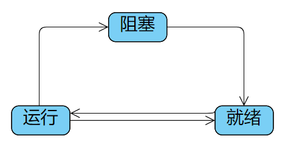
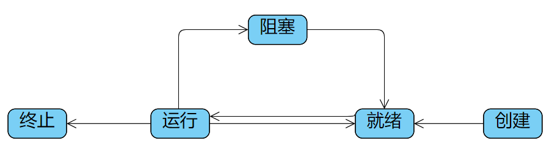
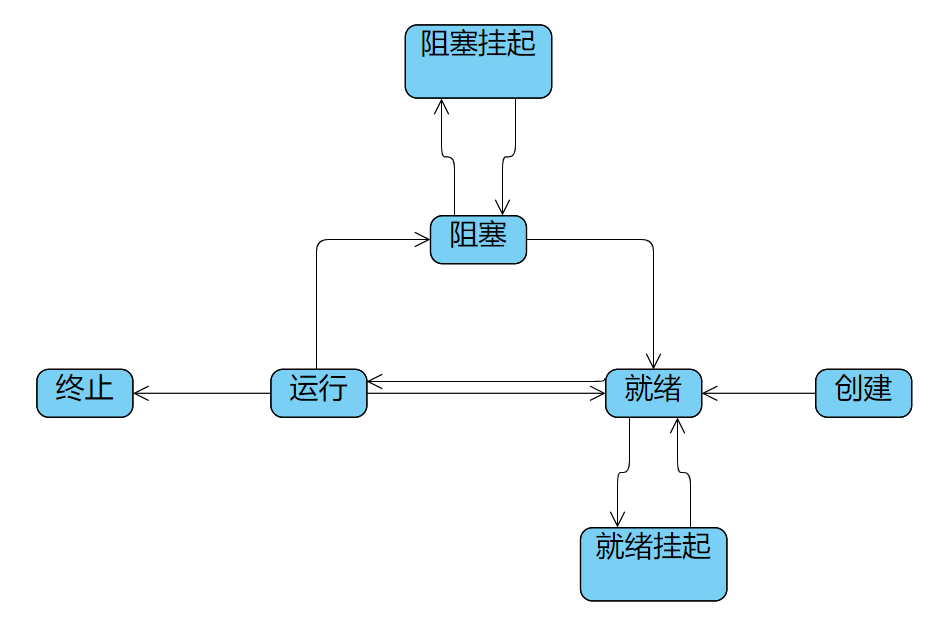

# 进程控制块

进程控制块的作用
使一个在多道程序环境下不能独立运行的**程序（含数据）**，成为一个能**独立运行**的基本单位或与其它进程并发执行的进程。

具体的说：
作为独立运行基本单位的标志 —— 当一个程序配置了PCB后，就表示它已是一个能在多道程序环境下独立运行的、合法的基本单位。PCB已经成为了进程存在于系统中的唯一标志。
能实现间断性运行方式 —— 有了PCB后，系统可以将终端进程的CPU现场信息存放在PCB中，供该进程在被调度时恢复CPU现场信息。
提供进程管理所需要的信息 —— 当进程调度时、需要访问文件或I/O设备时，都需要借助PCB中资源清单的信息。
提供进程调度所需要的信息 —— 进程调度时，需要提供优先级、等待时间和已执行时间等。
实现与其他进程的同步与通信 —— 进程同步，需要相应的用于同步的信号量，还需要具有用于实现进程通信的区域或通信队列指针等。
进程控制块中的信息
进程标识符：用于唯一标识一个进程。分为两种标识符：
外部标识符：为了方便用户（进程）对进程的访问，
内部标识符：为了方便系统对进程的使用，唯一的数字标识符
处理机状态：也称为处理机的上下文，主要是由处理机的各种寄存器中的内容组成的。这些寄存器主要包括：
通用寄存器 —— 又称为用户可视寄存器，是用户程序可以访问的，用于暂存信息，在大多数处理机中，由8~32个通用寄存器，在RISC结构的计算机中可超过100个。
指令计数器 —— 其中存放要访问的下一条指令的地址。
程序状态字PSW —— 含有状态信息，如：条件码、执行方式、中断屏蔽标志等
用户栈指针 —— 指每个用户进程都有一个或若干个与之相关的系统栈，用于存放过程和系统调用参数及调用地址。栈指针指向该栈的栈顶。
进程调度信息 ：包括进程状态、进程优先级、进程调度所需的其他信息、事件。
进程控制信息：程序和数据的地址、进程同步和通信机制、资源清单、链接指针。
进程控制块的组织方式
线性方式
链接方式
索引方式

# 进程转换三态模型

# 进程转换五态模型

# 进程转换七态模型

是操作系统核心中一种数据结构，主要表示进程状态。
